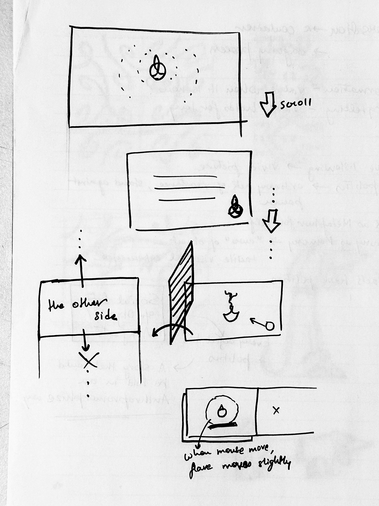
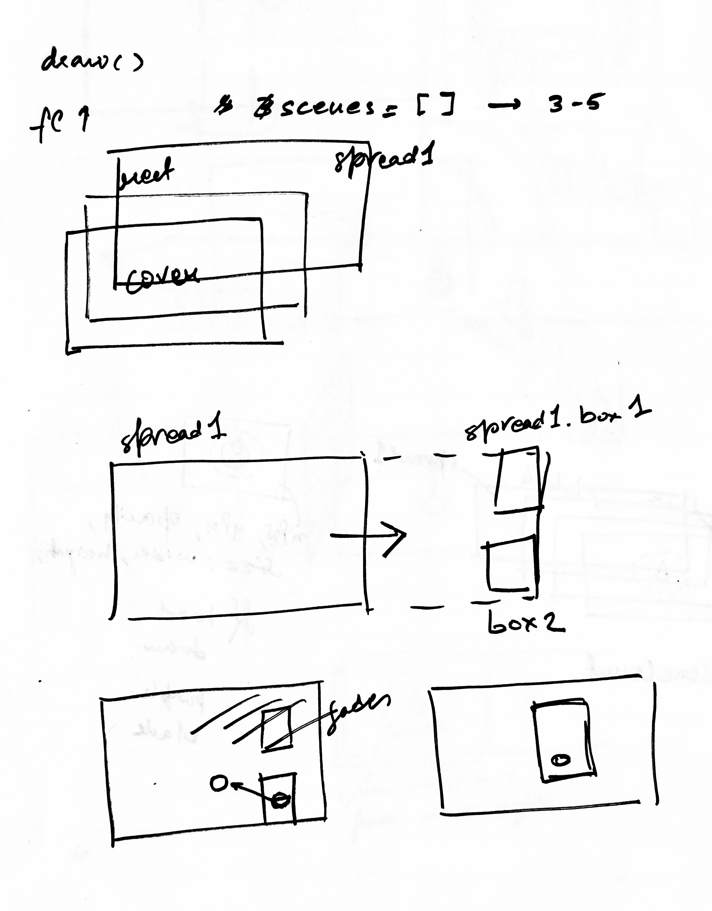
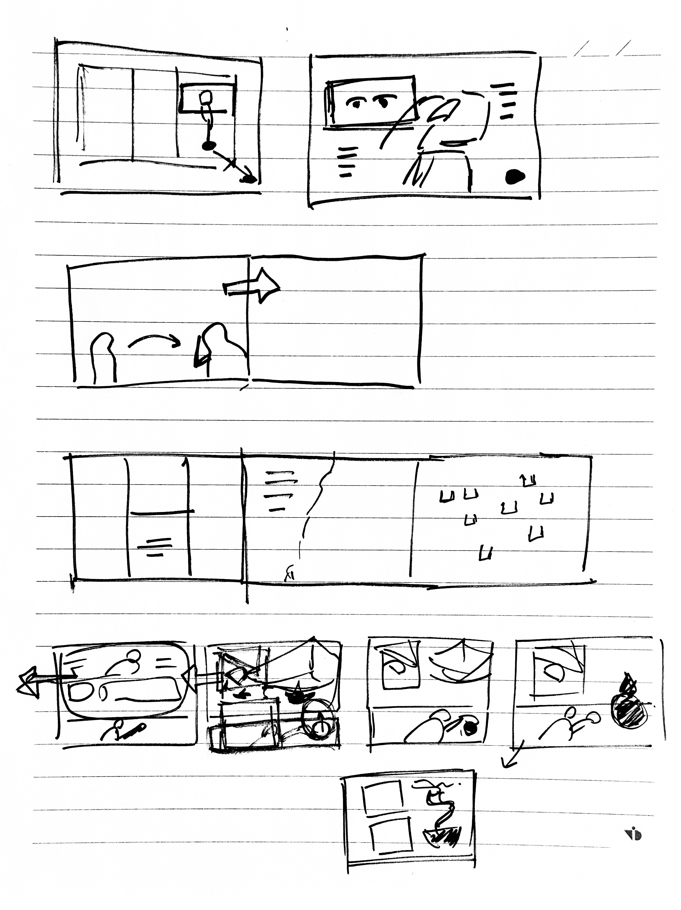

# Bujhta Banaras

## Why did I even pick this project?
I chose this project because I was dying to share this interactive story with more people, but the physical world was holding me back. The original version of *Bujhta Banaras* was a super tactile graphic novel, but producing it was a nightmare—each copy took forever to make because of all the manual flaps and mechanical bits. 

I knew a standard e-book wouldn't cut it. It would lose all that interactive "charm" that made the original special. My goal was to translate that specific feeling of discovery onto a digital screen, making sure the interactivity wasn't just a gimmick, but the core of the experience.

> the image of the book will go here

---

## How did I actually go about it (and where did I get stuck)?
To be honest, I had a rough start. My first plan was to just line up the comic pages and scroll through them, but that got messy fast. Interacting with scroll and images at the same time while trying to make things happen in a specific sequence (and not all at once) was a huge headache.

  
  
  

I tried to get fancy and use "Classes" and "Objects" for every scene, but it became so overwhelming that I felt stuck. I was spending more time fighting the code hierarchy than actually building the story.

The breakthrough happened when I hit reset. I ditched the complex objects and started with simple shape blocks. I built the entire scroll logic using just rectangles to figure out the layering and triggers. Once the "skeleton" felt right, I started swapping the shapes for the real videos and images. Building it "inside-out" like this let me focus on the timing without getting distracted by the final art until the logic was bulletproof.

---

## So, how does the magic actually work?
The whole narrative is basically "scroll-driven." I mapped the user's scroll position to almost every property—X/Y positions, opacity, scale, you name it. This is what lets things happen one after the other in a tight sequence.

But I didn't want it to *only* be about scrolling. I wanted to bring back that physical book DNA, so I added:
* **The Grab & Pull:** Specific pages require you to physically "pull" a layer up or "peel" a surface back to proceed.
* **Click to Reveal:** In Spread 6, I built a system where you have to click 13 different points. To make it intuitive, I added a "Sequential Glow"—only the *next* flap in the order pulses with a blurry light, guiding your eye without giving everything away at once.
* **Instructional UX:** I built custom functions for scroll, grab, and click icons that fade in and out to give the reader a rhythmic nudge on what to do next.

---

## What did I walk away with?
This project was a massive reality check on how different tactile and digital mediums really are. In the physical world, making an interaction "intuitive" feels like second nature. On a screen, it’s a battle to replicate that same sense of discovery. I found that to make digital actions clear, I often had to "over-explain" with icons, which can sometimes kill the mystery I was trying to create.

However, I realized the digital medium has a "secret weapon": Sound. I think adding audio could actually elevate this beyond what the physical book could ever do. While the project still needs some fine-tuning to feel 100% effortless for a casual reader, I’m excited to keep polishing it and use this digital version to take the story of Varanasi to a much bigger audience.

---
