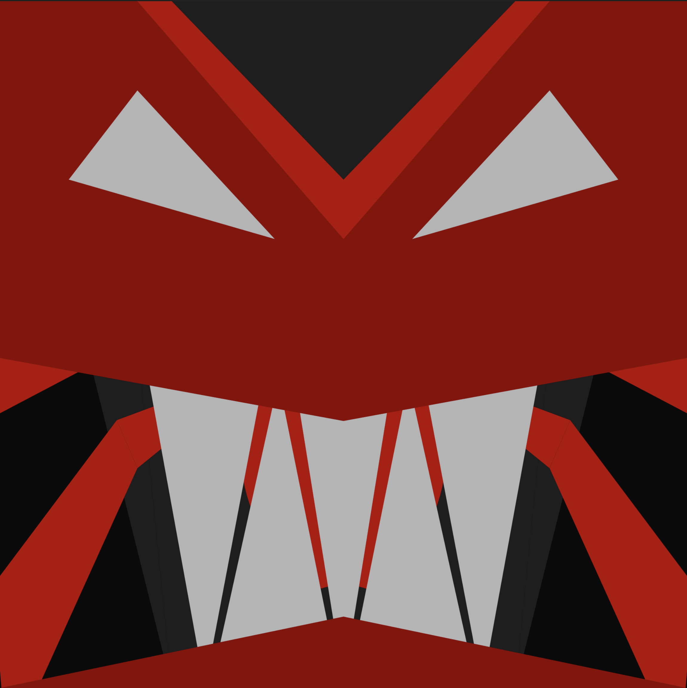

# Evoking Fear through Code

For the second assignment, I had to turn the theme of fear into anger. I started with my initial composition of a spider fan and used it as a base to evoke an expression of anger. The final composition depicts this anger through an expression featuring great teeth and sharp eyes.

To execute this transition, I used the mouseY function in p5.js to create a direct interaction between the viewer and the canvas. I applied this logic to all the shapes from my initial spider composition.

As I move the cursor along the Y-axis, the code tracks the mouse position and moves the shapes accordingly. This allows the initial "fans" of the spider to transform and shift into the final composition of the great, angry teeth. By linking the movement of the shapes to the vertical position of the mouse, I was able to bridge the two exercises and show the shift from fear to anger through a smooth, user-driven animation.

FROM:

TO:

