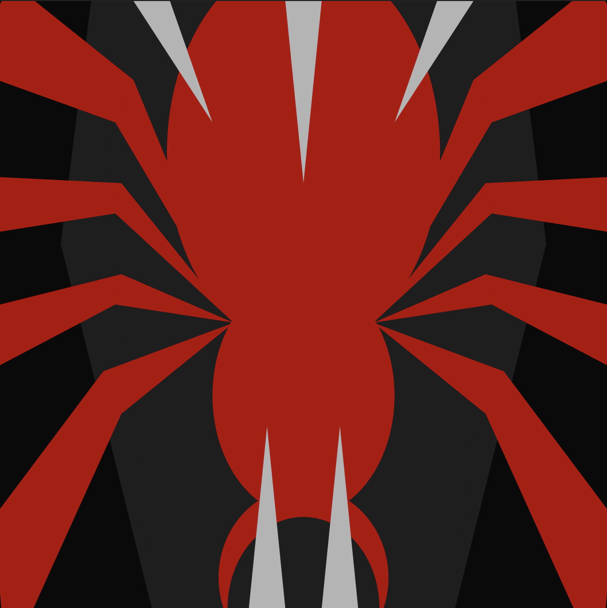

# Evoking Fear through Code

For this assignment, I was tasked with creating a composition that evokes fear. To do this, I went back to the strongest area I could think of: spiders. I elaborated on that idea and illustrated it through simple shapes.

In the piece, I used sharp edges and chords, composing it symmetrically with red, black, and green to emphasize the contrast. I also added pointy edges in the form of fangs or teeth to show a snake attacking the spider. Overall, the shapes and the color contrast work together with the concept to evoke a sense of fear in the final composition.

I used quad() for the legs, ellipse() for the main spider body, and triangle() for the fangs.

Final Piece:

TO:

