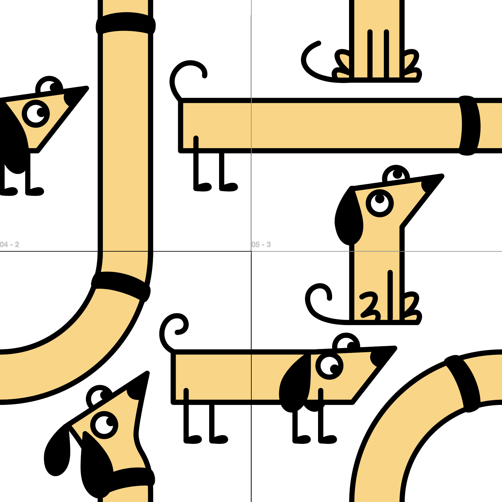
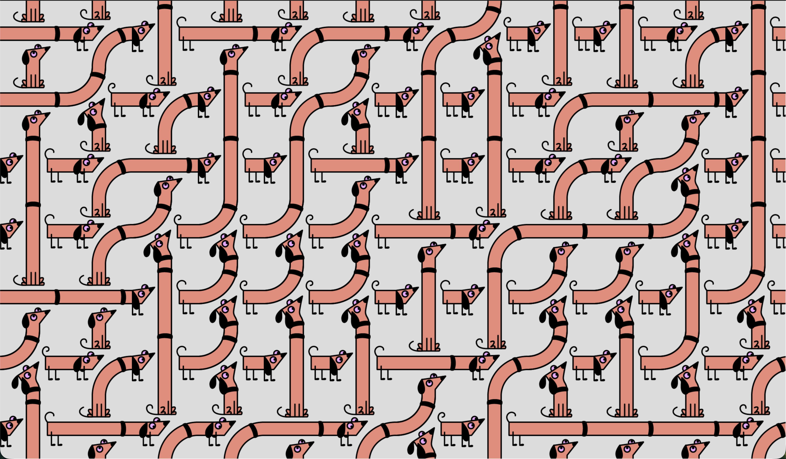

# Turning Dog Illustration to a Pattern

For this assignment, I created an illustration designed to be repeated randomly on a grid. I started with a dog illustration divided into four distinct blocks each containing a tail, a head, and a neck connector segment. The core idea was to ensure that every part in the grid shared common connection points. To achieve this, I used a tubular structure for the dog’s design, allowing the segments to flow into one another seamlessly regardless of their placement.

I implemented these four blocks within a grid system in p5.js. By using random generation, the code selects different compositions of these parts for each cell in the grid every time the sketch runs. Because the tubular segments are designed with matching entry and exit points, the system creates a unique, abstract shape of a dog with every refresh. This modular approach ensures that while the overall form is unpredictable and unique, the structural integrity of the illustration is maintained through those shared common points.

